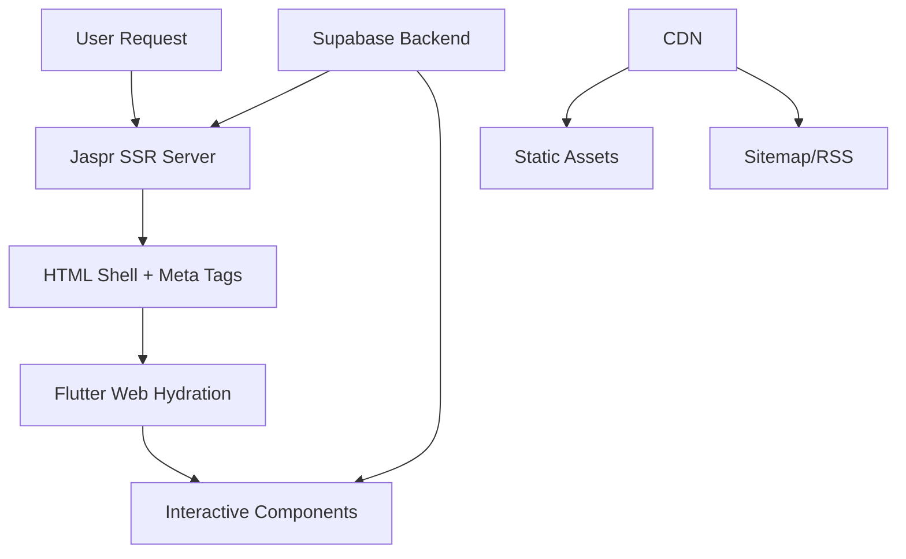

# 🚀 Modern Blogging Platform with Jaspr SSR + Flutter Web

> A comprehensive guide to building a high-performance, SEO-optimized blogging platform using Jaspr for server-side rendering, Flutter Web for interactive components, and Supabase as the backend.

## 📋 Table of Contents

- [🏗️ Architecture Overview](#-architecture-overview)
- [🛠️ Tech Stack](#-tech-stack)
- [📁 Project Structure](#-project-structure)
- [🔧 Setup Guide](#-setup-guide)
  - [Phase 0: Preparation & Planning](#phase-0-preparation--planning)
  - [Phase 1: Backend & CMS](#phase-1-backend--cms)
  - [Phase 2: Jaspr SSR Shell](#phase-2-jaspr-ssr-shell)
  - [Phase 3: Flutter Web Frontend](#phase-3-flutter-web-frontend)
  - [Phase 4: Admin Dashboard](#phase-4-admin-dashboard)
  - [Phase 5: CI/CD & Hosting](#phase-5-cicd--hosting)
  - [Phase 6: Monitoring & Testing](#phase-6-monitoring--testing)
- [🌟 Key Features](#-key-features)
- [📖 Detailed Implementation](#-detailed-implementation)
- [🚀 Deployment](#-deployment)
- [🔍 SEO & Performance](#-seo--performance)
- [📈 Monetization](#-monetization)
- [🤝 Contributing](#-contributing)

## 🏗️ Architecture Overview

This platform combines the best of both worlds:
- **Server-Side Rendering (SSR)** with Jaspr for SEO and fast initial page loads
- **Client-Side Rendering (CSR)** with Flutter Web for rich interactivity
- **Islands Architecture** for optimal performance with deferred loading



## 🛠️ Tech Stack

### Core Technologies
- **Frontend**: Jaspr (SSR) + Flutter Web (CSR)
- **Backend**: Supabase (PostgreSQL + Auth + Storage)
- **Hosting**: Google Cloud Run + CDN
- **CI/CD**: GitHub Actions

### Key Libraries
- `jaspr` - Server-side rendering framework
- `jaspr_flutter_embed` - Flutter embedding in Jaspr
- `supabase_flutter` - Supabase client
- `flutter_markdown` - Markdown rendering

## 📁 Project Structure

```
blogging-platform/
├── 📁 packages/
│   ├── 📁 blog_frontend/     # Flutter Web reader app
│   └── 📁 blog_admin/        # Flutter Web admin dashboard
├── 📁 server/
│   └── 📁 jaspr_ssr/         # Jaspr SSR application
├── 📁 infra/
│   ├── 📁 ci/                # GitHub Actions workflows
│   └── 📁 k8s/               # Kubernetes manifests (optional)
├── 📁 scripts/               # Utility scripts
│   ├── sitemap_generator.dart
│   └── rss_generator.dart
└── 📄 README.md
```

## 🔧 Setup Guide

### Phase 0: Preparation & Planning

#### 1. Repository Setup
```bash
git clone <your-repo>
cd blogging-platform
```

#### 2. Account Setup
Create accounts for:
- [ ] GitHub
- [ ] Supabase
- [ ] Google Cloud Platform
- [ ] Cloudflare (for CDN)
- [ ] Sentry (error monitoring)
- [ ] Google Analytics & Search Console

### Phase 1: Backend & CMS

#### 1. Supabase Project Setup

1. **Create Project**: Visit [Supabase Dashboard](https://supabase.com/dashboard)
2. **Enable Services**: Auth, Database, Storage

#### 2. Database Schema

```sql
-- Posts table
CREATE TABLE public.posts (
  id           uuid DEFAULT uuid_generate_v4() PRIMARY KEY,
  author_id    uuid REFERENCES auth.users(id) ON DELETE SET NULL,
  title        text NOT NULL,
  slug         text UNIQUE NOT NULL,
  content      text NOT NULL,
  excerpt      text,
  image_url    text,
  published    bool DEFAULT false,
  published_at timestamp with time zone,
  created_at   timestamp with time zone DEFAULT now(),
  updated_at   timestamp with time zone DEFAULT now()
);

-- Enable RLS
ALTER TABLE public.posts ENABLE ROW LEVEL SECURITY;
```

#### 3. Row Level Security (RLS) Policies

```sql
-- Public can read published posts
CREATE POLICY select_published ON public.posts
  FOR SELECT USING (published = true);

-- Admins can modify all posts
CREATE POLICY admins_modify ON public.posts
  FOR ALL USING (auth.role() = 'authenticated' AND auth.uid() IN (
    SELECT id FROM public.users WHERE role = 'admin'
  ));
```

#### 4. Storage Setup

1. Create bucket: `post_images`
2. Configure public read access
3. Set up image transformation policies

### Phase 2: Jaspr SSR Shell

#### 1. Initialize Jaspr Project

```bash
cd server
dart create -t server-simple jaspr_ssr
cd jaspr_ssr
dart pub add jaspr supabase
```

#### 2. Server Implementation

```dart
// bin/main.dart
import 'package:jaspr/server.dart';
import 'app.dart';
import 'jaspr_options.dart';

void main() {
  Jaspr.initializeApp(options: defaultJasprOptions);
  runApp(Document(
    head: [
      script(src: 'main.dart.js', []),
    ],
    body: App(),
  ));
}
```

#### 3. SEO Meta Tags Implementation

```dart
// Example article page component
Document.head(
  title: post.title,
  meta: {
    'description': post.excerpt,
    'og:type': 'article',
    'og:title': post.title,
    'og:description': post.excerpt,
    'og:image': post.imageUrl,
  }
);
```

#### 4. JSON-LD Structured Data

```dart
yield script(
  type: 'application/ld+json',
  [
    text(r'''
      {
        "@context": "https://schema.org",
        "@type": "Article",
        "headline": "''' + post.title + r'''",
        "author": {"@type": "Person", "name": "''' + post.authorName + r'''"},
        "datePublished": "''' + post.publishedAt.toIso8601String() + r'''",
        "image": "''' + post.imageUrl + r'''",
        "articleBody": "''' + post.excerpt + r'''",
        "url": "''' + siteUrl + '/posts/' + post.slug + r'''"
      }
    ''')
  ]
);
```

### Phase 3: Flutter Web Frontend

#### 1. Create Flutter Project

```bash
cd packages
flutter create blog_frontend
cd blog_frontend
```

#### 2. Project Structure (Clean Architecture)

```
lib/
├── main.dart
├── app/
│   ├── router.dart
│   └── dependency_injection.dart
├── features/
│   └── article/
│       ├── presentation/
│       │   ├── article_screen.dart
│       │   └── article_bloc.dart
│       ├── domain/
│       │   └── article_entity.dart
│       └── data/
│           └── article_repository.dart
└── shared/
    ├── widgets/
    └── services/
```

#### 3. Deferred Loading Implementation

```dart
// main.dart
import 'article_screen.dart' deferred as article;
import 'comments_widget.dart' deferred as comments;

// Route handling
Future<Widget> _buildArticlePage(String slug) async {
  await article.loadLibrary();
  return article.ArticleScreen(slug: slug);
}
```

#### 4. Interactive Islands

```dart
@client
class CommentsSection extends StatefulComponent {
  // This component will be hydrated on the client
}
```

### Phase 4: Admin Dashboard

#### 1. Create Admin Flutter App

```bash
cd packages
flutter create blog_admin
cd blog_admin
```

#### 2. Key Features Implementation

- **Authentication**: Supabase Auth integration
- **Post Editor**: Markdown editor with live preview
- **Media Management**: Image upload to Supabase Storage
- **Publishing**: Draft/Schedule/Publish workflow
- **Analytics**: Basic post metrics

### Phase 5: CI/CD & Hosting

#### 1. GitHub Actions Workflow

```yaml
# .github/workflows/ci.yml
name: CI/CD Pipeline

on:
  push:
    branches: [main]
  pull_request:
    branches: [main]

jobs:
  test:
    runs-on: ubuntu-latest
    steps:
      - uses: actions/checkout@v4
      - uses: dart-lang/setup-dart@v1
      - uses: subosito/flutter-action@v2
      
      - name: Run tests
        run: |
          dart test
          flutter test

  build-and-deploy:
    needs: test
    runs-on: ubuntu-latest
    if: github.ref == 'refs/heads/main'
    
    steps:
      - uses: actions/checkout@v4
      
      - name: Build Docker image
        run: |
          docker build -t gcr.io/${{ secrets.GCP_PROJECT }}/blog-ssr:${{ github.sha }} ./server
          
      - name: Deploy to Cloud Run
        uses: google-github-actions/deploy-cloudrun@v2
        with:
          image: gcr.io/${{ secrets.GCP_PROJECT }}/blog-ssr:${{ github.sha }}
          service: blog-ssr
          region: us-central1
          
      - name: Build Flutter Web
        run: |
          flutter build web --release
          
      - name: Deploy to CDN
        run: |
          # Deploy to your CDN (Cloudflare, S3, etc.)
```

#### 2. Docker Configuration

```dockerfile
# server/Dockerfile
FROM dart:stable AS build
WORKDIR /app
COPY pubspec.* ./
RUN dart pub get
COPY . .
RUN dart compile exe bin/server.dart -o server

FROM gcr.io/distroless/cc
COPY --from=build /app/server /server
EXPOSE 8080
CMD ["/server"]
```

### Phase 6: Monitoring & Testing

#### 1. Error Monitoring

```dart
// Initialize Sentry
await SentryFlutter.init(
  (options) {
    options.dsn = 'YOUR_SENTRY_DSN';
  },
  appRunner: () => runApp(MyApp()),
);
```

#### 2. Analytics Integration

```dart
// Google Analytics 4
GoogleAnalytics.initialize(measurementId: 'G-XXXXXXXXXX');
GoogleAnalytics.trackPageView('/posts/$slug');
```

## 🌟 Key Features

### ✅ Performance Optimizations
- Server-side rendering for fast initial loads
- Deferred loading of interactive components
- CDN distribution for static assets
- Image optimization and lazy loading

### ✅ SEO Excellence
- Proper meta tags and Open Graph
- JSON-LD structured data
- Automatic sitemap generation
- RSS feed support

### ✅ Developer Experience
- Hot reload in development
- Type-safe Dart throughout
- Clean architecture patterns
- Comprehensive testing

### ✅ Content Management
- Rich markdown editor
- Media library integration
- Draft/schedule/publish workflow
- Role-based access control

## 📖 Detailed Implementation

### Mediavine Ad Integration

```dart
// Insert Mediavine script in document head
Document.head(
  scripts: [
    script(
      id: 'mvjs',
      src: 'https://scripts.mediavine.com/tags/your-site-id.js',
      []
    )
  ]
);

// Trigger ad placement after content loads
@JS()
external void triggerMediavineAds();
```

### Flutter-Jaspr Embedding

```dart
// Embed Flutter widgets in Jaspr pages
yield FlutterEmbedView(
  loader: CircularProgressIndicator(),
  widget: MyFlutterWidget(data: postData),
);
```

### Supabase Integration

```dart
// Initialize Supabase client
final supabase = SupabaseClient(
  'YOUR_SUPABASE_URL',
  'YOUR_SUPABASE_ANON_KEY',
);

// Fetch posts with RLS
final posts = await supabase
    .from('posts')
    .select()
    .eq('published', true)
    .order('published_at', ascending: false);
```

## 🚀 Deployment

### Cloud Run Deployment

```bash
# Build and push Docker image
docker build -t gcr.io/your-project/blog-ssr .
docker push gcr.io/your-project/blog-ssr

# Deploy to Cloud Run
gcloud run deploy blog-ssr \
  --image gcr.io/your-project/blog-ssr \
  --platform managed \
  --region us-central1 \
  --allow-unauthenticated \
  --min-instances 1
```

### CDN Setup

1. **Cloudflare**: Upload Flutter Web build to Workers KV
2. **AWS**: S3 + CloudFront distribution
3. **Vercel**: Static hosting for Flutter assets

## 🔍 SEO & Performance

### Core Web Vitals Optimization

- **LCP**: Optimized with SSR and image preloading
- **FID**: Minimized with deferred JavaScript loading
- **CLS**: Prevented with proper layout reserving

### Sitemap Generation

```dart
// scripts/sitemap_generator.dart
void generateSitemap() async {
  final posts = await fetchAllPosts();
  final sitemap = '''<?xml version="1.0" encoding="UTF-8"?>
<urlset xmlns="http://www.sitemaps.org/schemas/sitemap/0.9">
${posts.map((post) => '''
  <url>
    <loc>https://yourdomain.com/posts/${post.slug}</loc>
    <lastmod>${post.updatedAt.toIso8601String()}</lastmod>
  </url>
''').join()}
</urlset>''';
  
  await File('sitemap.xml').writeAsString(sitemap);
}
```

## 📈 Monetization

### Mediavine Integration

The platform includes built-in support for Mediavine ads with:
- Automatic ad placement
- Lazy loading optimization
- Mobile-responsive ad units
- Analytics integration

### Additional Revenue Streams

- Newsletter subscriptions
- Premium content
- Affiliate marketing
- Sponsored posts

## 🤝 Contributing

1. Fork the repository
2. Create a feature branch (`git checkout -b feature/amazing-feature`)
3. Commit your changes (`git commit -m 'Add amazing feature'`)
4. Push to the branch (`git push origin feature/amazing-feature`)
5. Open a Pull Request

### Development Setup

```bash
# Clone the repository
git clone https://github.com/your-username/blogging-platform.git
cd blogging-platform

# Install dependencies
dart pub get
flutter pub get

# Run in development
dart run bin/server.dart
flutter run -d chrome
```

---

## 📚 References

- [Jaspr Documentation](https://docs.jaspr.dev)
- [Supabase Documentation](https://supabase.com/docs)
- [Flutter Web Documentation](https://docs.flutter.dev/platform-integration/web)
- [Google Cloud Run Documentation](https://cloud.google.com/run/docs)
- [Mediavine Help Center](https://help.mediavine.com)
- [Google Search Central](https://developers.google.com/search)

---

**Built with ❤️ using Dart, Flutter, and modern web technologies**